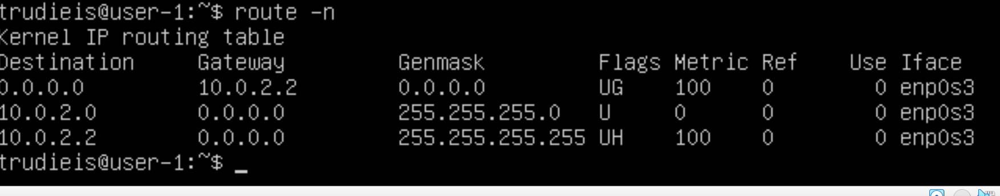
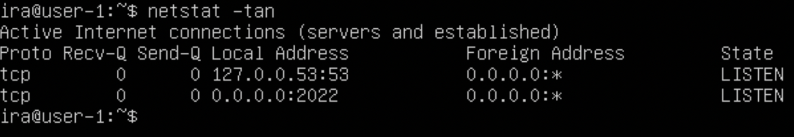
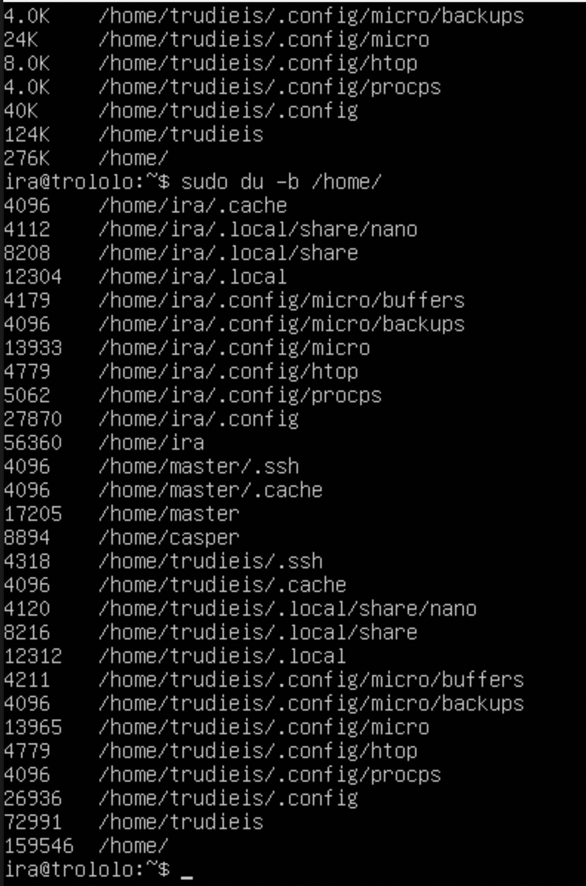

## Part 1. Установка ОС

#### Установить **Ubuntu 20.04 Server LTS** без графического интерфейса. (Используем программу для виртуализации - VirtualBox)

- Узнайте версию Ubuntu, выполнив команду \
`cat /etc/issue.`

  

## Part 2. Создание пользователя

#### Создать пользователя, отличного от пользователя, который создавался при установке. 

- Вставьте скриншот вызова команды для создания пользователя.

  

 - Пользователь должен быть добавлен в группу `adm`.

    

- Новый пользователь должен быть в выводе команды \
`cat /etc/passwd`

  

## Part 3. Настройка сети ОС

#### Задать название машины вида user-1
- Задать название машины вида user-1

  

#### Установить временную зону, соответствующую вашему текущему местоположению.

#### Вывести названия сетевых интерфейсов с помощью консольной команды.

- lo (loopback device) - виртуальный сетевой интерфейс. Используется для отладки сетевых программ и запуска серверных приложений на локальной машине по адресу 127.0.0.1 (localhost).

#### Используя консольную команду получить ip адрес устройства, на котором вы работаете, от DHCP сервера. 

- Dynamic Host Configuration Protocol — протокол динамической настройки узла, позволяющий сетевым устройствам автоматически получать IP-адрес и другие параметры, необходимые для работы в сети TCP/IP.

#### Определить и вывести на экран внешний ip-адрес шлюза (ip) и внутренний IP-адрес шлюза, он же ip-адрес по умолчанию (gw). 

- внешний IP

- внутренний IP адрес шлюза

  

- Задать статичные настройки ip, gw, dns (использовать публичный DNS серверы, например 1.1.1.1 или 8.8.8.8).

  

 - Перезагрузить виртуальную машину. Убедиться, что статичные сетевые настройки (ip, gw, dns) соответствуют заданным в предыдущем пункте. 

- Успешно пропинговать удаленные хосты `1.1.1.1` и `ya.ru` и вставить в отчёт скрин с выводом команды. В выводе команды должна быть фраза "0% packet loss".

  

## Part 4. Обновление ОС

#### Обновить системные пакеты до последней на момент выполнения задания версии.  

  

## Part 5. Использование команды **sudo**

##### Разрешить пользователю, выполнять команду sudo.

- sudo позволяет другому пользователю выполнять команду от суперпользователя, либо другого пользователя. Команда используется для разграничения полномочий между пользователями входящими в группу sudo, не выдавая при этом пароля root

- Поменять hostname ОС от имени пользователя, созданного в пункте [Part 2] используя sudo).

  

## Part 6. Установка и настройка службы времени

- Вывести время, часового пояса, в котором вы сейчас находитесь.

- Вывод следующей команды должен содержать `NTPSynchronized=yes`: 
timedatectl show
- Вставить скрины с корректным временем и выводом команды в отчёт.

## Part 7. Установка и использование текстовых редакторов 

- установка редакторов командой `sudo apt install vim nano micro`
#### Используя каждый из трех выбранных редакторов, создайте файл *test_X.txt*, где X название редактора, в котором создан файл. Напишите в нём свой никнейм, закройте файл с сохранением изменений.

- Vim

  

- для выхода и сохранения нужно сочетание клавишь `:wq`

- Nano

  
- для выхода и сохранения последовательность клавишь `ctrl+O` и подтвердить выбраный файл для сохранения и `ctrl+X` для выхода

- Micro

  
- для выхода и сохранения последовательность клавишь ctrl+S и ctrl+Q
- содержимое всех файлов

#### Используя каждый из трех выбранных редакторов, откройте файл на редактирование, отредактируйте файл, заменив никнейм на строку "21 School 21", закройте файл без сохранения изменений.

- Vim 

- выход без сохранения `:q!`

- Nano

- выход без сохранения  ctrl+x и N

- Micro

- выход без сохранения `ctrl + Q` и N

- содержимое всех файлов

#### Используя каждый из трех выбранных редакторов, отредактируйте файл ещё раз (по аналогии с предыдущим пунктом), а затем освойте функции поиска по содержимому файла (слово) и замены слова на любое другое.

- результаты поиска слова.

  ### Vim

- для поиска нажимаем `/что ищем`

  

- для замены вводим `:%s/что меняем/на что`

  

  ### Nano

- для поиска нажимаем `ctrl+W` и пишем что ищем 

  

- для замены вводим `ctrl+\` и пишем 'что заменить' `enter` 'на что'

  

### Micro

- для поиска нажимаем `ctrl+F` и пишем что ищем 

  

- для замены вводим `ctrl + E` открывается командная строка, печатаем `replace` что  на что, подтверждаем изменения

  

## Part 8. Установка и базовая настройка сервиса **SSHD**

- Установить службу `sshd`

- Добавить автостарт службы при загрузке системы. 

- Перенастраиваем службу `sshd` на `порт 2022` редактируя конфиг `sudo vim /etc/ssh/sshd.config`

- перзапускаем службу для принятия настроек

- Используя команду `ps`, показать наличие процесса `sshd`. Для этого к команде нужно подобрать ключи.

  

Утилита `ps` одна из самых простых и в то же время часто используемых программ для просмотра списка процессов в Linux.

-a - выбрать все процессы, кроме фоновых

-u - выбрать процессы пользователя

-x - При отображении процессов, соответствующих другим параметрам, включите процессы, у которых нет управляющего терминала. Это противоположность опции -X. Если в одной команде указаны и -X, и -x, то ps будет использовать тот, который был указан последним.

- Перезагружаем систему командой `reboot`

- Вывод команды `netstat -tan`

Программа `netstat` показывает статус сети, флаг `-t` отображает список соединения TCP, флаг `-a` показывает список всех портов, флаг `-n` отображает в числовом формате, не отображая имя хоста.

Расшифровка столбцов: 
1 - протокол подключения, 2 - полученные пакеты, 3 - отправленные пакеты, 4 - локальный адрес, 5 - удаленный адресс, 6 - статус.

Адресс `0.0.0.0` используется в сети как немаршрутизируемый адрес IPv4, он используется во время инициализации системы, когда устройство использует его до того, как ему будет назначен реальный IP-адрес, в качестве адреса по умолчанию.

## Part 9. Установка и использование утилит **top**, **htop**

#### Top
- По выводу команды top определить и написать в отчёте:

uptime 1час 54 минуты

количество авторизованных пользователей 1 user

общую загрузку системы load average 0,00 0,00 0,00

общее количество процессов tasks 94

загрузку cpu 

загрузку памяти

pid процесса занимающего больше всего памяти

pid процесса, занимающего больше всего процессорного времени

- В отчёт вставить скрин с выводом команды htop:

отсортированному по PID

отсортированному по PERCENT_CPU

отсортированному по PERCENT_MEM

отсортированному по TIME

отфильтрованному для процесса sshd

с процессом syslog, найденным, используя поиск

с добавленным выводом hostname, clock и uptime

## Part 10. Использование утилиты **fdisk**
- Запустить команду fdisk -l.

- название жесткого диска /dev/sda
- его размер 10G
- количество секторов 20971520
- размер swap 1.47G

## Part 11. Использование утилиты df
- Запустить команду df /

- размер раздела 8408452
- размер занятого пространства 4745636
- размер свободного пространства 3214100
- процент использования 60%

единица измерения в выводе килобайт

- Запустить команду df -Th /

- размер раздела 8.1G
- размер занятого пространства 4.6G
- размер свободного пространства 3.1G
- процент использования 60%

тип файловой системы для раздела ext4(extendet file system)

## Part 12. Использование утилиты du

- Запустить команду du и вывести размер папок (в байтах)
#### /home

  

#### /var

  

#### /var/log

  

- Вывести размер папок (в человекочитаемом виде)
#### /home

  

#### /var

  

#### /var/log

  

- Вывести размер всего содержимого в /var/log (не общее, а каждого вложенного элемента, используя *)
`sudo du -ha /var/log/*`

  

## Part 13. Установка и использование утилиты ncdu
- Установить утилиту ncdu

- Запускаем командой `ncdu /` Вывести размер папок /home, /var, /var/log.

  

  

## Part 14. Работа с системными журналами
- Открыть для просмотра:

1. /var/log/dmesg

    

2. /var/log/syslog

    

3. /var/log/auth.log

    

- время последней успешной авторизации, имя пользователя и метод входа в систему

  

- Перезапустить службу SSHd

  

- Вставить в отчёт скрин с сообщением о рестарте службы (искать в логах) `sudo cat /var/log/syslog`

  

## Part 15. Использование планировщика заданий CRON

- Используя планировщик заданий, запустите команду uptime через каждые 2 минуты.

  

- Найти в системных журналах строчки (минимум две в заданном временном диапазоне) о выполнении.

  

- Вывести на экран список текущих заданий для CRON.

  

- Удалите все задания из планировщика заданий.

  